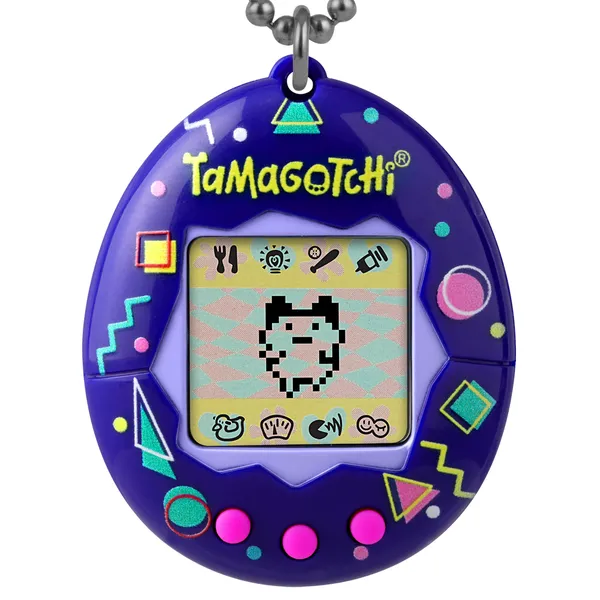

# Tests & Refactoring

Esta clase plantea una solución _poco objetosa_ a un ejercicio.
El objetivo es primero _testearla_ codeando pruebas automatizadas y luego _refactorizarla_ aprovechando las ideas del paradigma.

### Objetivos de esta clase
1. _Comparar soluciones_ más algorítimicas vs más objetosas
1. _Formalizar las pruebas_ del programa
    1. Pasar de la consola al código con `tests`
    1. Plantear los casos de prueba (a.k.a clases de equivalencia)
1. Seguir con la _metodología_ propuesta
    1. Pienso las pruebas antes de tocaar el código
    1. El testing forma parte del desarrollo
1. Se puede _mejorar_ el diseño sin cambiar la funcionalidad

### Elementos del lenguaje
- `if`
- `null`
- Ejercutar tests por consola

### Apuntes teóricos
1. [Introducción al testeo unitario automatizado.](https://docs.google.com/document/d/1Q_v48gZfRmVfLMvC0PBpmtZyMoALbh11AwmEllP__eY/edit?usp=drive_web)

----

# Tamagotchi

Los _Tamagotchi_ son mascotas virtuales que tuvieron su pico de popularidad en los 2000.
Se trataban de aparatos que venían con un bichito que te demandaba cuidado.
Había que hacerlos jugar, comer, bañar, etc. para que estén contentos, crezcan fuertes y no mueran.

## Enunciado

Modelar un Tamagotchi del cual se conoce su edad, felicidad y el estado de ánimo, que puede ser hambriento o cansado (uno de los dos)

Un Tamagotchi puede jugar:
- si está cansado pasa a estar hambriento
- si está hambriento reduce su felicidad en 2
- sino auntenta su felicidad en 1

Y también puede comer:
- si está hambriento crece, lo que aumenta en uno su edad y se le va cualquier estado de ánimo que tenga
- si está cansado reduce su felicidad en 1
- además, idenpendiente de los casos anteriores, si su edad es mayor a 10, queda cansado

Al iniciar el aparato, el Tamagotchi comienza con 10 de felicidad, 0 de edad y sin ningún estado de ánimo

## Solución

Se plantea una solución que modela el estado de ánimo con un string (nullable), teniendo `if`s en los métodos `jugar()` y `comer()`

[Link al código](../ejemplos/tamagotchi.wlk)

#### Leer el código en conjunto para entender los `if`

# 1. Pruebas automatizadas

#### Preguntas gatillo

> ¿Este programa soluciona lo pedido?

_Respuesta:_ sí

> ¿Cómo lo sabemos?

_Respuesta:_ eso creemos, para garantizarlo habría que _probarlo_

## Tests

Introducimos la idea de _testing_
- son pruebas automatizadas que podemos ejecutar
  - código que prueba que el otro código anda como se espera
- independientes y reproducibles
  - "el mundo se reinicia entre cada ejecución"
- estructura:
  1. preparo
  1. ejecuto
  1. **compruebo** (esto es nuevo!)

#TODO
- Escribir los casos de prueba
- Cambiar el código para que use polimorfismo
